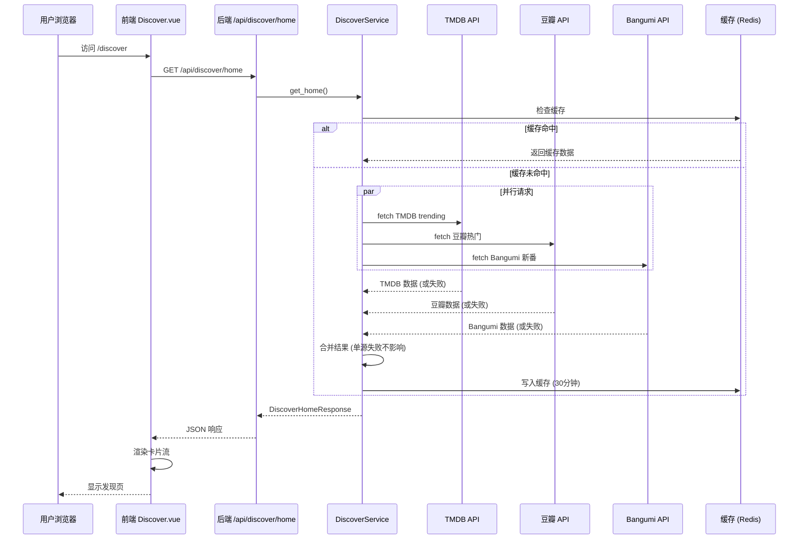
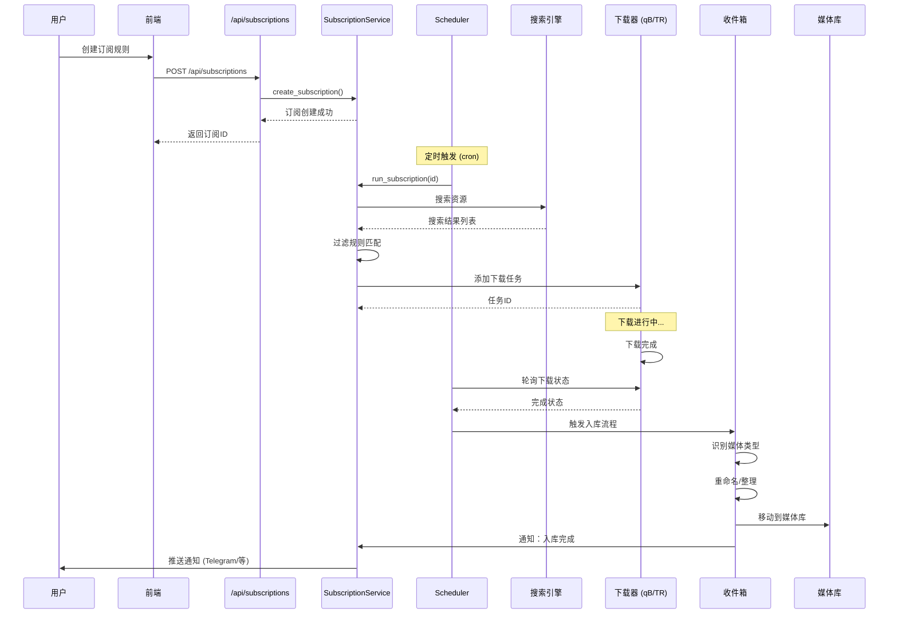
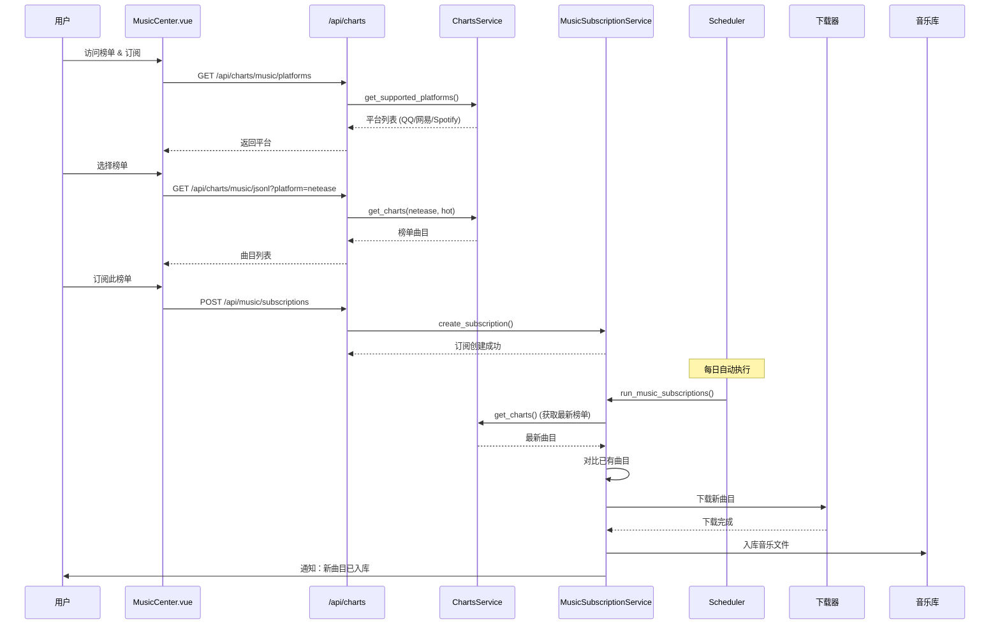
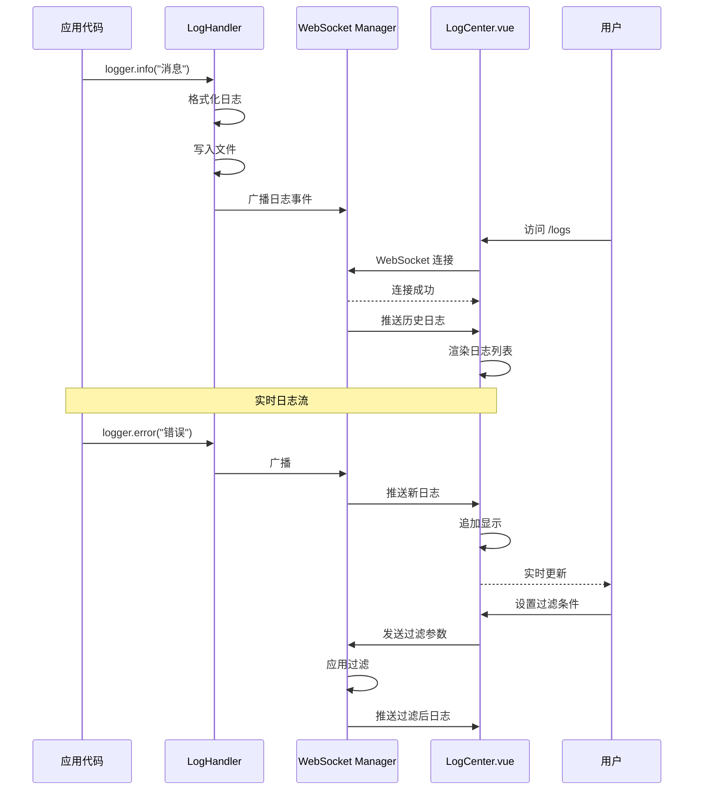
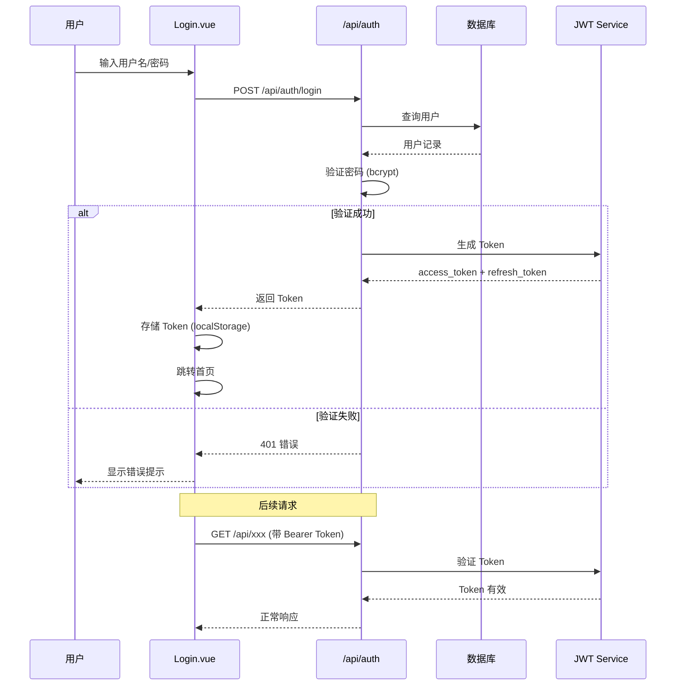

# VabHub 关键链路时序 (CRITICAL_FLOWS)

> 端到端时序图 + 失败点与降级策略

---

## 1. 发现页多源聚合

### 时序图



### 关键数据结构

```python
class DiscoverHomeResponse(BaseModel):
    sections: List[DiscoverSection]  # 各源区块
    has_public_keys: bool
    has_private_keys: bool
    key_source: str  # "public" / "private" / "none"
    message: Optional[str]
```

### 失败点与降级

| 失败点 | 影响 | 降级策略 |
|--------|------|----------|
| TMDB 无 Key | 无 TMDB 内容 | 显示豆瓣/Bangumi 内容 |
| TMDB API 超时 | 无 TMDB 内容 | 日志警告，返回其他源 |
| 豆瓣 API 失败 | 无豆瓣内容 | 返回其他源 |
| Bangumi API 失败 | 无 Bangumi 内容 | 返回其他源 |
| 全部失败 | 空页面 | 显示"暂无热门内容" |
| Redis 不可用 | 每次都请求源 | 降级为无缓存模式 |

---

## 2. 订阅 → 下载 → 入库

### 时序图



### 关键数据结构

```python
class Subscription(BaseModel):
    id: int
    name: str
    media_type: str  # movie/tv/music/book
    keyword: str
    filter_rules: dict
    schedule: str  # cron 表达式
    status: str  # active/paused
```

### 失败点与降级

| 失败点 | 影响 | 降级策略 |
|--------|------|----------|
| 搜索无结果 | 无下载 | 记录日志，下次重试 |
| 下载器离线 | 无法下载 | 返回错误，UI 显示状态 |
| 下载失败 | 任务中断 | 标记失败，支持手动重试 |
| 入库识别失败 | 文件未整理 | 保留在收件箱，等待手动处理 |
| 通知发送失败 | 用户无感知 | 日志记录，不影响主流程 |

---

## 3. 音乐榜单 → 订阅 → 自动循环

### 时序图



### 失败点与降级

| 失败点 | 影响 | 降级策略 |
|--------|------|----------|
| 榜单 API 失败 | 无榜单数据 | 返回缓存数据 |
| 订阅执行失败 | 无新内容 | 记录日志，下次重试 |
| 音乐下载失败 | 曲目缺失 | 标记失败，支持重试 |

---

## 4. 日志中心

### 时序图



### 关键数据结构

```python
class LogEntry(BaseModel):
    timestamp: datetime
    level: str  # DEBUG/INFO/WARNING/ERROR
    source: str  # 模块名
    message: str
    extra: Optional[dict]
```

### 失败点与降级

| 失败点 | 影响 | 降级策略 |
|--------|------|----------|
| WebSocket 断连 | 无实时更新 | 前端自动重连 |
| 日志文件写入失败 | 日志丢失 | 降级为 stdout |
| Redis 不可用 | 广播失败 | 降级为文件读取 |

---

## 5. 用户认证流程

### 时序图



---

## Evidence (P5)

### 关键文件引用

1. `backend/app/services/discover_service.py` - 发现页聚合
2. `backend/app/modules/subscription/` - 订阅服务
3. `backend/app/modules/download/` - 下载模块
4. `backend/app/modules/inbox/` - 收件箱入库
5. `backend/app/modules/charts/service.py` - 榜单服务
6. `backend/app/api/log_center.py` - 日志 API
7. `backend/app/core/log_handler.py` - 日志处理
8. `backend/app/api/auth.py` - 认证 API
9. `frontend/src/pages/Discover.vue`
10. `frontend/src/pages/MusicCenter.vue`
11. `frontend/src/pages/LogCenter.vue`
12. `frontend/src/pages/Login.vue`

### 关键发现

1. **并行请求** - 发现页多源并行，单源失败不阻塞
2. **定时调度** - 订阅通过 Scheduler 定时执行
3. **WebSocket** - 日志实时推送
4. **JWT 认证** - 无状态 Token 认证

---

*生成时间: 2025-12-13 23:25 UTC+8*
